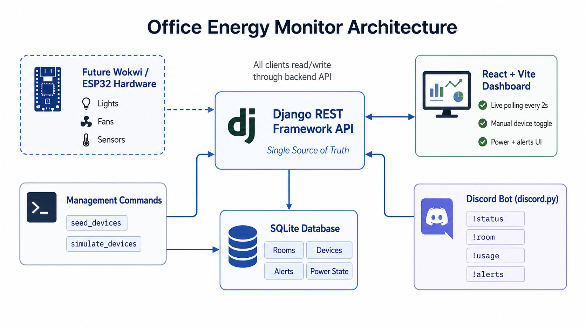
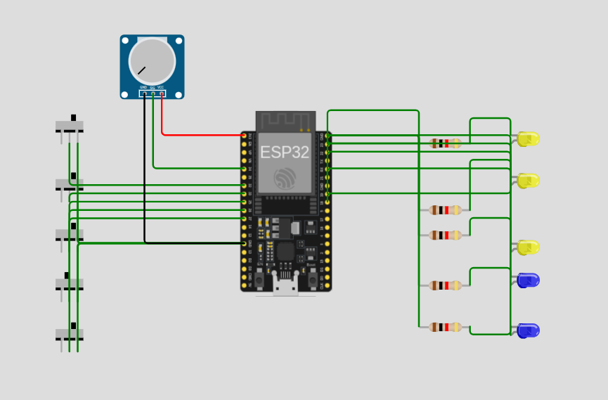
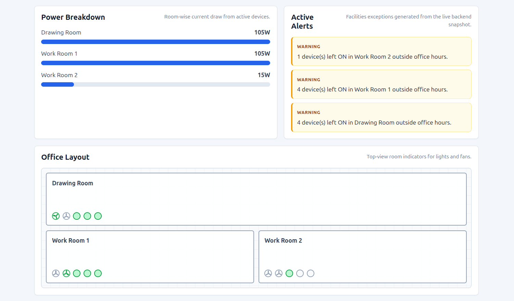
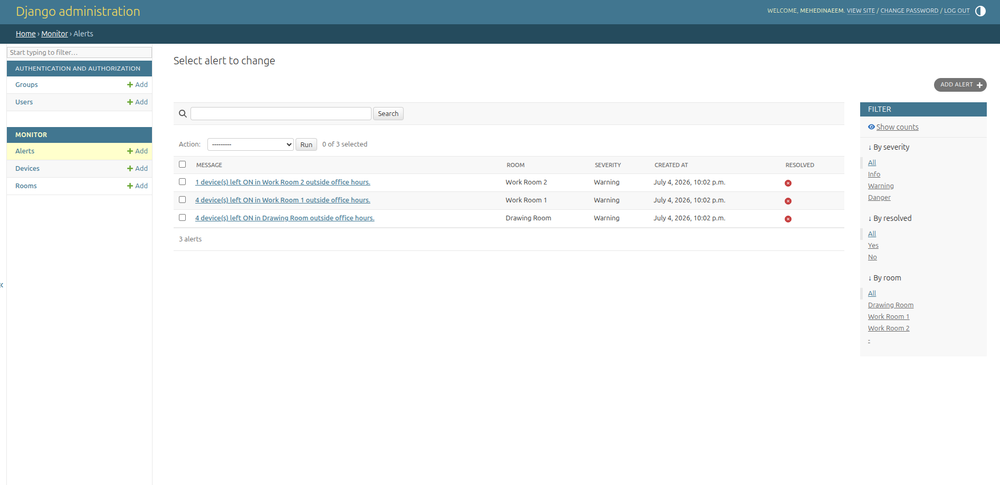

# Office Energy Monitor

A hackathon project for monitoring office lights, fans, and electricity usage through a live web dashboard and a Discord bot.

The system uses a Python simulation script to generate live office device data. The Django backend stores and processes the device state, the React dashboard displays the live status, and the Discord bot allows users to check the same data directly from Discord.

---

## Project Overview

In a small office, people often leave lights and fans running after office hours. This increases electricity usage and makes it difficult to track wasted power.

Office Energy Monitor solves this by providing:

- Live device monitoring
- Room-wise light and fan status
- Total and room-wise power usage
- Active alerts for abnormal situations
- A React web dashboard
- A Discord bot for quick status checks
- Automatic Discord warning messages
- A Wokwi hardware/electrical schematic for one representative room

---

## Office Setup

The office has 3 rooms:

| Room | Description |
|---|---|
| Drawing Room | Waiting area |
| Work Room 1 | Employee work room |
| Work Room 2 | Employee work room |

Each room has:

| Device Type | Quantity | Wattage |
|---|---:|---:|
| Fan | 2 | 60W each |
| Light | 3 | 15W each |

Total devices:

```text
3 rooms × 5 devices = 15 devices
```

> Note: Wattage values are assumed for demo calculation only.

---

## Features

### Backend Features

- Django backend
- Django REST Framework API
- SQLite database
- Room, Device, and Alert models
- Python simulation script
- Device seed command
- Power usage calculation
- Alert generation
- Manual device toggle API
- Backend tests

### Dashboard Features

- React + Vite dashboard
- Live device status
- Room-wise device panels
- Total power usage
- Room-wise power breakdown
- Active alerts panel
- Auto-refresh without manual page reload
- Professional office monitoring UI

### Discord Bot Features

- Built with `discord.py`
- Reads real data from the Django backend
- Supports:
  - `!status`
  - `!room drawing`
  - `!room work1`
  - `!room work2`
  - `!usage`
  - `!alerts`
  - `!help`
- Sends automatic alert messages to a Discord channel
- Prevents duplicate alert spam

### Hardware / Electrical Schematic

A Wokwi simulation is included to show how one office room could be wired and sensed in real life.

Wokwi project link:

```text
https://wokwi.com/projects/468554658383958017
```

---

## Tech Stack

| Layer | Technology |
|---|---|
| Backend | Django, Django REST Framework |
| Database | SQLite |
| Simulation | Python / Django management command |
| Frontend | React, Vite |
| Bot | discord.py |
| Hardware Concept | Wokwi ESP32 |
| Version Control | Git, GitHub |

---

## System Architecture

The backend is the single source of truth. The React dashboard and Discord bot both read from the same Django REST API.

```text
Python Simulation Script
        ↓
Django REST API ↔ SQLite Database
        ↓
React Web Dashboard + Discord Bot
        ↓
      User
```

### Architecture Diagram

Add your software architecture diagram here:

```md

```

Image to add:

```text
diagrams/architecture.png
```

---

## Hardware / Electrical Schematic

The Wokwi schematic represents one office room.

The representative room contains:

- ESP32
- 3 light indicators
- 2 fan indicators
- 5 switches
- Fixed power values for calculation

Wokwi link:

```text
https://wokwi.com/projects/468554658383958017
```

### Hardware Schematic Image



### Pin Mapping

| Device | Switch Pin | Output Pin | Wattage |
|---|---:|---:|---:|
| Light 1 | GPIO 32 | GPIO 18 | 15W |
| Light 2 | GPIO 33 | GPIO 19 | 15W |
| Light 3 | GPIO 25 | GPIO 21 | 15W |
| Fan 1 | GPIO 26 | GPIO 22 | 60W |
| Fan 2 | GPIO 27 | GPIO 23 | 60W |

### Hardware Explanation

The Wokwi schematic is a representative circuit for one room. The same circuit concept can be repeated for Work Room 1 and Work Room 2.

In the simulation, ESP32 reads switch states and controls output indicators. In a real deployment, actual lights and fans should be connected through proper relay modules, current sensors, isolation, and electrical protection. This project only uses Wokwi as a safe conceptual simulation.

---

## Repository Structure

```text
Office-Energy-Monitor/
├── backend/
│   ├── config/
│   ├── monitor/
│   ├── requirements.txt
│   └── manage.py
│
├── frontend/
│   ├── src/
│   ├── package.json
│   └── vite.config.js
│
├── bot/
│   ├── bot.py
│   ├── requirements.txt
│   ├── .env.example
│   └── README.md
│
├── diagrams/
│   ├── architecture.png
│   ├── hardware-schematic.png
│   ├── dashboard_01
│   ├── dashboard_02.png
│   ├── db.png
│   └── Discord_server.png
│
├── docs/
│   └── pin-mapping.md
│
├── README.md
└── .gitignore
```

---

# Setup Instructions

The project has three main software parts:

1. Django backend
2. React frontend
3. Discord bot

You should run them in separate terminals.

---

# Backend Setup

## Ubuntu / Linux

Open a terminal from the project root:

```bash
cd backend
python3 -m venv .venv
source .venv/bin/activate
pip install -r requirements.txt
python manage.py migrate
python manage.py seed_devices
python manage.py runserver
```

Backend will run at:

```text
http://127.0.0.1:8000
```

Health check:

```bash
curl http://127.0.0.1:8000/api/health/
```

Expected response:

```json
{"status":"ok"}
```

---

## Windows PowerShell

Open PowerShell from the project root:

```powershell
cd backend
py -m venv .venv
.\.venv\Scripts\Activate.ps1
pip install -r requirements.txt
python manage.py migrate
python manage.py seed_devices
python manage.py runserver
```

If PowerShell blocks virtual environment activation, run:

```powershell
Set-ExecutionPolicy -ExecutionPolicy RemoteSigned -Scope CurrentUser
```

Then activate again:

```powershell
.\.venv\Scripts\Activate.ps1
```

Backend will run at:

```text
http://127.0.0.1:8000
```

Health check in browser:

```text
http://127.0.0.1:8000/api/health/
```

Expected response:

```json
{"status":"ok"}
```

---

## Windows CMD Alternative

```cmd
cd backend
py -m venv .venv
.venv\Scripts\activate
pip install -r requirements.txt
python manage.py migrate
python manage.py seed_devices
python manage.py runserver
```

---

# Python Simulation Script

The simulator changes device states over time so the dashboard always has live data to show.

It simulates:

- Device ON/OFF status
- Power draw
- Last changed timestamp
- Room-wise device state
- Alert conditions

## Ubuntu / Linux

Open a new terminal:

```bash
cd backend
source .venv/bin/activate
python manage.py simulate_devices
```


---

# Frontend Setup

## Ubuntu / Linux

Open a new terminal from the project root:

```bash
cd frontend
npm install
npm run dev
```

Frontend will run at:

```text
http://localhost:5173
```

For local development, the frontend uses this API URL by default:

```text
http://127.0.0.1:8000/api
```

To point the frontend to a deployed backend, create `frontend/.env`:

```env
VITE_API_BASE_URL=https://office-energy-monitor-y6jt.onrender.com/api
```

---

## Windows PowerShell

```powershell
cd frontend
npm install
npm run dev
```

Frontend will run at:

```text
http://localhost:5173
```

---

# Deployment

The project is prepared for:

- Backend on Render
- Frontend on Netlify
- PostgreSQL on Render for production data

## Backend Deployment on Render

Render can use the included `render.yaml` file from the repository root.

The included Render blueprint defines:

- `office-energy-monitor-backend` as the Django web API
- `office-energy-monitor-simulator` as a background worker
- `office-energy-monitor-discord-bot` as a background worker
- `office-energy-monitor-db` as PostgreSQL

Recommended backend web settings if configuring manually:

| Setting | Value |
|---|---|
| Root Directory | `backend` |
| Build Command | `./build.sh` |
| Start Command | `python manage.py migrate --noinput && python manage.py seed_devices && gunicorn config.wsgi:application` |

Set these environment variables in Render:

```env
DJANGO_SECRET_KEY=generate-a-secure-secret
DJANGO_DEBUG=False
DJANGO_ALLOWED_HOSTS=office-energy-monitor-y6jt.onrender.com
CORS_ALLOWED_ORIGINS=https://office-energy-monitor.netlify.app
CSRF_TRUSTED_ORIGINS=https://office-energy-monitor.netlify.app
DATABASE_URL=your-render-postgres-connection-string
```

Notes:

- Render PostgreSQL should provide `DATABASE_URL`.
- `seed_devices` is safe to run more than once and prevents duplicate rooms/devices.
- Static files are collected during build and served with WhiteNoise.
- The simulator worker uses the same `DATABASE_URL`, so it updates the same database that the dashboard and bot read from.

After deployment, test:

```text
https://office-energy-monitor-y6jt.onrender.com/api/health/
```

Expected response:

```json
{"status":"ok"}
```

## Frontend Deployment on Netlify

Netlify can use the included root `netlify.toml`.

Recommended Netlify settings if configuring manually:

| Setting | Value |
|---|---|
| Base directory | `frontend` |
| Build command | `npm run build` |
| Publish directory | `frontend/dist` |

Set this environment variable in Netlify:

```env
VITE_API_BASE_URL=https://office-energy-monitor-y6jt.onrender.com/api
```

After Netlify deploys, update the Render backend environment variables:

```env
CORS_ALLOWED_ORIGINS=https://office-energy-monitor.netlify.app
CSRF_TRUSTED_ORIGINS=https://office-energy-monitor.netlify.app
```

Then redeploy the Render backend.

## Discord Bot Worker on Render

The bot can run as a Render background worker. It should use the deployed backend API, not local host.

Set these worker environment variables:

```env
DISCORD_TOKEN=your-real-discord-bot-token
API_BASE_URL=https://office-energy-monitor-y6jt.onrender.com/api
ALERT_CHANNEL_ID=your-discord-alert-channel-id
```

Keep `DISCORD_TOKEN` secret. Do not commit it to GitHub.

## Simulator Worker on Render

The simulator can run as a Render background worker with:

```text
Root Directory: backend
Build Command: ./build.sh
Start Command: python manage.py migrate --noinput && python manage.py seed_devices && python manage.py simulate_devices
```

It must use the same `DATABASE_URL` as the backend web service.

# Deployment Checklist

- Backend health endpoint works on Render
- Frontend `VITE_API_BASE_URL` points to the Render backend `/api`
- Render CORS allows the Netlify site URL
- Render `DJANGO_DEBUG` is `False`
- Render `DJANGO_SECRET_KEY` is not the development fallback
- Render has a PostgreSQL `DATABASE_URL`
- Simulator worker is running if you want automatic live demo changes
- Discord bot worker has `DISCORD_TOKEN`, `API_BASE_URL`, and `ALERT_CHANNEL_ID`
- Netlify build completes successfully
- Dashboard loads live `/api/snapshot/` data

---

# Discord Bot Setup

## 1. Create Discord Bot

The Discord bot has been created and invited to the Discord server.

Server invite:

```text
https://discord.gg/3Jwks5rfC
```


---

## 2. Configure Environment Variables

Inside the `bot/` folder, create a file named:

```text
.env
```

Use this format:

```env
DISCORD_TOKEN=your_real_discord_bot_token_here
API_BASE_URL=http://127.0.0.1:8000/api
ALERT_CHANNEL_ID=your_discord_channel_id_here
```


---

## 3. Run Discord Bot

## Ubuntu / Linux

Open a new terminal:

```bash
cd bot
python3 -m venv .venv
source .venv/bin/activate
pip install -r requirements.txt
python bot.py
```


---

## Discord Bot Commands

| Command | Description |
|---|---|
| `!help` | Shows available commands |
| `!status` | Shows current office status |
| `!room drawing` | Shows Drawing Room status |
| `!room work1` | Shows Work Room 1 status |
| `!room work2` | Shows Work Room 2 status |
| `!usage` | Shows power usage and estimated cost |
| `!alerts` | Shows active alerts |

Example command:

```text
!status
```

Example output:

```text
Office Status

Drawing Room: 2 fans ON, 3 lights ON | 165W
Work Room 1: 1 fan ON, 2 lights ON | 90W
Work Room 2: 1 fan ON, 3 lights ON | 105W

Total Power: 360W
Devices ON: 12/15
Active Alerts: 3
```

---

# Running the Full Project

You need four terminals.

---

## Terminal 1: Django Backend

Ubuntu / Linux:

```bash
cd backend
source .venv/bin/activate
python manage.py runserver
```

Windows PowerShell:

```powershell
cd backend
.\.venv\Scripts\Activate.ps1
python manage.py runserver
```

Windows CMD:

```cmd
cd backend
.venv\Scripts\activate
python manage.py runserver
```

---

## Terminal 2: Python Simulator

Ubuntu / Linux:

```bash
cd backend
source .venv/bin/activate
python manage.py simulate_devices
```

Windows PowerShell:

```powershell
cd backend
.\.venv\Scripts\Activate.ps1
python manage.py simulate_devices
```

Windows CMD:

```cmd
cd backend
.venv\Scripts\activate
python manage.py simulate_devices
```

---

## Terminal 3: React Frontend

Ubuntu / Linux and Windows:

```bash
cd frontend
npm run dev
```

---

## Terminal 4: Discord Bot

Ubuntu / Linux:

```bash
cd bot
source .venv/bin/activate
python bot.py
```

Windows PowerShell:

```powershell
cd bot
.\.venv\Scripts\Activate.ps1
python bot.py
```

Windows CMD:

```cmd
cd bot
.venv\Scripts\activate
python bot.py
```

---

# API Endpoints

| Method | Endpoint | Description |
|---|---|---|
| GET | `/api/health/` | Backend health check |
| GET | `/api/snapshot/` | Full live dashboard data |
| GET | `/api/devices/` | List all devices |
| GET | `/api/usage/` | Total and room-wise power usage |
| GET | `/api/alerts/` | Active alerts |
| GET | `/api/rooms/<slug>/` | Room details |
| POST | `/api/devices/<id>/toggle/` | Toggle device state manually |

Example:

```bash
curl http://127.0.0.1:8000/api/snapshot/
```

---

# Data Model

## Room

Stores room information.

Rooms:

```text
Drawing Room
Work Room 1
Work Room 2
```

## Device

Stores device state.

Fields include:

```text
name
room
device_type
status
wattage
current_power
last_changed
turned_on_at
```

## Alert

Stores active alert information.

Fields include:

```text
room
message
severity
created_at
resolved
```

---

# Alert Logic

The backend generates alerts for abnormal situations.

Current alert rules:

1. Devices left ON outside office hours
2. High power usage
3. Room/device status warnings

Office hours:

```text
9 AM to 5 PM
```

Example alert:

```text
Work Room 2 has 2 fan(s) and 3 light(s) ON after office hours.
```

The Discord bot can automatically post active alerts to a selected Discord channel.

---

# Power Calculation

Device wattage:

```text
Fan = 60W
Light = 15W
```

Room maximum power:

```text
2 fans × 60W = 120W
3 lights × 15W = 45W

Total per room = 165W
```

Full office maximum power:

```text
3 rooms × 165W = 495W
```

Estimated usage:

```text
Estimated hourly kWh = total_power / 1000
Estimated office-day usage = hourly_kWh × 8
Estimated cost = office-day kWh × assumed rate
```

The demo uses an assumed electricity rate for cost estimation.

---

# Screenshots

## Dashboard Screenshot




## Django Admin / Database Screenshot



## Discord Server Screenshot

Server invite:

```text
https://discord.gg/3Jwks5rfC
```


## Architecture Diagram

```md

```

Image to add:

```text
diagrams/architecture.png
```


---

# Testing

## Backend Tests

Ubuntu / Linux:

```bash
cd backend
source .venv/bin/activate
python manage.py test
```

Windows PowerShell:

```powershell
cd backend
.\.venv\Scripts\Activate.ps1
python manage.py test
```

Windows CMD:

```cmd
cd backend
.venv\Scripts\activate
python manage.py test
```

Expected result:

```text
OK
```

---

# Demo Video


```text
Demo Video: video
```

---


# Final Notes

Office Energy Monitor demonstrates a complete software-based office energy monitoring system.

The Python simulation script generates live device data. The Django backend stores and processes the state. The React dashboard and Discord bot both read from the same backend, ensuring one shared source of truth. The Wokwi schematic shows how the system could be connected to real hardware in the future.
