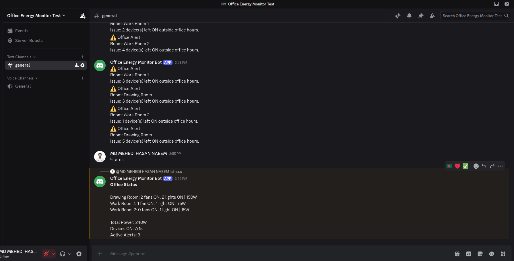

# Office Energy Monitor Discord Bot

Discord bot for reading live Office Energy Monitor data from the Django REST API.

The bot does not store room or device data. It fetches current data from the backend so the dashboard and Discord bot share the same source of truth.

## Setup

Create a virtual environment:

```bash
cd bot
python3 -m venv .venv
source .venv/bin/activate
pip install -r requirements.txt
```

Create your environment file:

```bash
cp .env.example .env
```

Edit `.env`:

```text
DISCORD_TOKEN=your_real_discord_bot_token
API_BASE_URL=http://127.0.0.1:8000/api
ALERT_CHANNEL_ID=
```

Do not commit `.env`.

## Discord Developer Portal

Enable **Message Content Intent** for the bot in the Discord Developer Portal. The bot uses the `!` command prefix, so it needs permission to read message content.

## Discord Server

The bot has been invited to the Discord server used for the demo.

Server invite:

```text
https://discord.gg/3Jwks5rfC
```



## Run

Make sure the Django backend is running first:

```bash
cd ../backend
source .venv/bin/activate
python manage.py runserver
```

Then run the bot:

```bash
cd ../bot
source .venv/bin/activate
python bot.py
```

## Commands

```text
!help
!status
!room drawing
!room work1
!room work2
!usage
!alerts
```

## Optional Proactive Alerts

Set `ALERT_CHANNEL_ID` in `.env` to a Discord text channel ID. The bot will check alerts every 30 seconds and send new alerts to that channel without repeating the same alert in memory.

## Render Worker Deployment

The bot can run as a Render background worker.

Manual Render settings:

```text
Root Directory: bot
Build Command: pip install -r requirements.txt
Start Command: python bot.py
```

Required environment variables:

```env
DISCORD_TOKEN=your_real_discord_bot_token
API_BASE_URL=https://your-render-service.onrender.com/api
ALERT_CHANNEL_ID=your_discord_channel_id
```

Do not use `http://127.0.0.1:8000/api` on Render. The bot worker must call the deployed backend URL.
